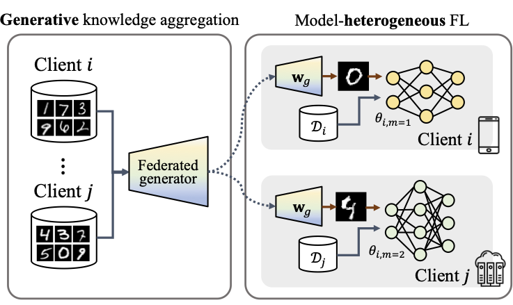
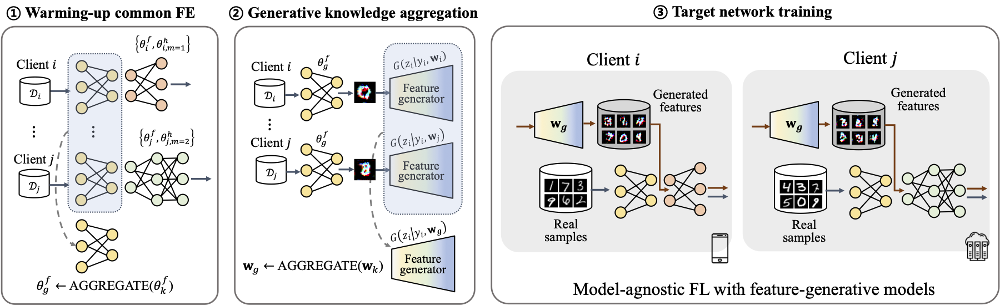

# GeFL: Model-Agnostic Federated Learning with Generative Models

### [Honggu Kang] &nbsp;&nbsp; [Seohyeon Cha] &nbsp;&nbsp; [Joonhyuk Kang]  
### [KAIST (Korea Advanced Institute of Science and Technology)]  
### [[Paper]] &nbsp;&nbsp; [[Code]]

 

### TL;DR
Federated learning of heterogeneous model architectures aided by generative models

### Abstract

Federated learning (FL) is a promising paradigm in distributed learning while preserving the privacy of users.
However, the increasing size of recent models makes it unaffordable for a few users to encompass the model. It leads the users to adopt heterogeneous models based on their diverse computing capabilities and network bandwidth. Correspondingly, FL with heterogeneous models should be addressed, given that FL typically involves training a single global model. In this paper, we propose Generative Model-Aided Federated Learning (GeFL), incorporating a generative model that aggregates global knowledge across users of heterogeneous models. Our experiments on various classification tasks demonstrate notable performance improvements of GeFL compared to baselines, as well as limitations in terms of privacy and scalability. To tackle these concerns, we introduce a novel framework, GeFL-F. It trains target networks aided by feature-generative models. We empirically demonstrate the consistent performance gains of GeFL-F, while demonstrating better privacy preservation and robustness to a large number of clients.

----
[Honggu Kang]: https://honggkang.github.io/about/
[Seohyeon Cha]: https://seohyeon-cha.github.io/
[Joonhyuk Kang]: https://artlab.kaist.ac.kr/bbs/board.php?bo_table=sub1_1
[KAIST (Korea Advanced Institute of Science and Technology)]: https://kaist.ac.kr/
[Paper]: https://arxiv.org/abs/2412.18460
[Code]: https://github.com/honggkang/hetero-model-fl-gen
