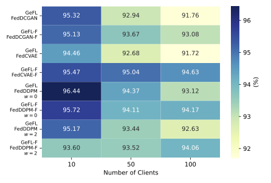
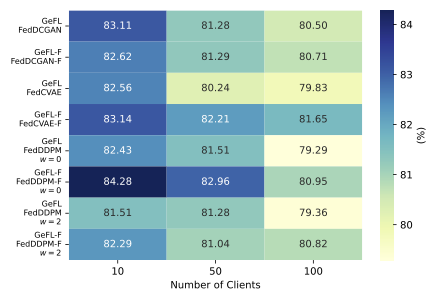
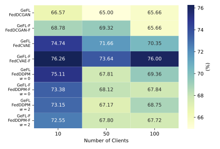
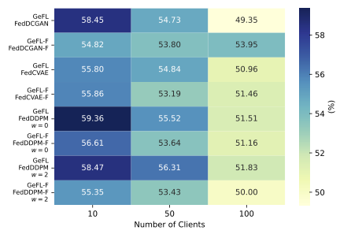
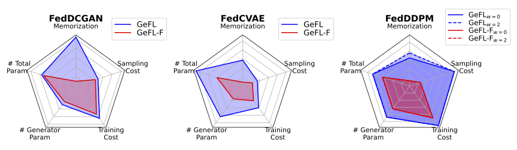

Mean classification acc. (%) evaluation of different methods on the MNIST, FMNIST, and CIFAR10 dataset.

<table>
   <tr>
       <th></th>
       <th>MNIST</th>
       <th>FMNIST</th>
       <th>CIFAR10</th>
   </tr>
   <tr>
       <td>FedAvg</td>
       <td>92.62</td>
       <td>80.58</td>
       <td>55.65</td>
   </tr>
   <tr>
       <td>FedProx</td>
       <td>92.57</td>
       <td>80.50</td>
       <td>55.10</td>
   </tr>
   <tr>
       <td>AvgKD</td>
       <td>92.81</td>
       <td>77.12</td>
       <td>26.36</td>
   </tr>
   <tr>
       <td>FedDF</td>
       <td>91.39</td>
       <td>58.81</td>
       <td>57.17</td>
   </tr>
   <tr>
       <td>LG-FedAvg</td>
       <td>92.71</td>
       <td>80.61</td>
       <td>54.49</td>
   </tr>
   <tr>
       <td><b>GeFL</b> (FedDCGAN)</td>
       <td>95.32</td>
       <td><b>83.11</b></td>
       <td>58.45</td>
   </tr>
   <tr>
       <td><b>GeFL</b> (FedCVAE)</td>
       <td>94.46</td>
       <td>82.33</td>
       <td>55.80</td>
   </tr>
   <tr>
       <td><b>GeFL</b> (FedDDPMw=0)</td>
       <td><b>96.44</b></td>
       <td>82.43</td>
       <td>59.36</td>
   </tr>
   <tr>
       <td><b>GeFL</b> (FedDDPMw=2)</td>
       <td>95.17</td>
       <td>81.51</td>
       <td><b>58.47</b></td>
   </tr>
</table>

Mean classification acc. (%) comparison to data augmentation. GeFL outperforms other baselines and is effective combined with data augmentation.
<table>
   <tr>
       <th></th>
       <th>FedAvg</th>
       <th>GeFL (FedDCGAN)</th>
   </tr>
   <tr>
       <td>None</td>
       <td>55.65&plusmn;0.68</td>
       <td>58.45&plusmn;0.49</td>
   </tr>
   <tr>
       <td>MixUp</td>
       <td>60.07&plusmn;1.13</td>
       <td><b>62.67&plusmn;0.24</b></td>
   </tr>
   <tr>
       <td>CutMix</td>
       <td>58.95&plusmn;0.61</td>
       <td>61.66&plusmn;0.41</td>
   </tr>
   <tr>
       <td>AugMix</td>
       <td>53.96&plusmn;0.37</td>
       <td>56.47&plusmn;0.25</td>
   </tr>
   <tr>
       <td>AutoAugment</td>
       <td>56.99&plusmn;0.43</td>
       <td>59.97&plusmn;0.38</td>
   </tr>
</table>

Scalability in client numbers of GeFL and GeFL-F on MNIST, FMNIST, SVHN, and CIFAR dataset. GeFL-F exhibits less performance degradation in a large number of clients compared to GeFL.

<figure>
    
    <figcaption>MNIST</figcaption>
    
    <figcaption>FMNIST</figcaption>
</figure>

<figure>
    
    <figcaption>SVHN</figcaption>
    
    <figcaption>CIFAR10</figcaption>
</figure>

<!-- *MNIST*
*FMNIST*

*SVHN*
*CIFAR10* -->

<!-- 

 -->

Comparison of privacy, communication and computational costs in GeFL and GeFL-F. Lower values indicate better conditions for each component.

