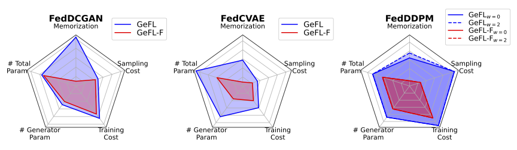

Mean classification acc. (\%) evaluation of different methods on the MNIST, FMNIST, and CIFAR10 dataset.

<table>
   <tr>
       <th></th>
       <th>MNIST</th>
       <th>FMNIST</th>
       <th>CIFAR10</th>
   </tr>
   <tr>
       <td>FedAvg</td>
       <td>92.62</td>
       <td>80.58</td>
       <td>45.11</td>
   </tr>
   <tr>
       <td>FedProx</td>
       <td>92.57</td>
       <td>80.50</td>
       <td>43.33</td>
   </tr>
   <tr>
       <td>AvgKD</td>
       <td>92.81</td>
       <td>77.12</td>
       <td>23.57</td>
   </tr>
   <tr>
       <td>FedDF</td>
       <td>91.39</td>
       <td>58.81</td>
       <td>48.77</td>
   </tr>
   <tr>
       <td>LG-FedAvg</td>
       <td>92.71</td>
       <td>80.61</td>
       <td>--</td>
   </tr>
   <tr>
       <td><b>GeFL</b> (FedDCGAN)</td>
       <td>95.32</td>
       <td><b>83.11</b></td>
       <td>50.43</td>
   </tr>
   <tr>
       <td><b>GeFL</b> (FedCVAE)</td>
       <td>94.46</td>
       <td>82.33</td>
       <td>45.81</td>
   </tr>
   <tr>
       <td><b>GeFL</b> (FedDDPMw=0)</td>
       <td><b>96.44</b></td>
       <td>82.43</td>
       <td>48.84</td>
   </tr>
   <tr>
       <td><b>GeFL</b> (FedDDPMw=2)</td>
       <td>95.17</td>
       <td>81.51</td>
       <td><b>50.91</b></td>
   </tr>
</table>

Mean classification acc. (%) comparison to data augmentation. GeFL outperforms other baselines and is effective combined with data augmentation.
<table>
   <tr>
       <th></th>
       <th>FedAvg</th>
       <th>GeFL (FedDCGAN)</th>
   </tr>
   <tr>
       <td>None</td>
       <td>45.11&plusmn;0.46</td>
       <td>50.43&plusmn;1.01</td>
   </tr>
   <tr>
       <td>MixUp</td>
       <td>47.99&plusmn;3.15</td>
       <td><b>52.95&plusmn;0.78</b></td>
   </tr>
   <tr>
       <td>CutMix</td>
       <td>46.61&plusmn;1.29</td>
       <td>51.21&plusmn;1.09</td>
   </tr>
   <tr>
       <td>AugMix</td>
       <td>45.18&plusmn;0.92</td>
       <td>51.76&plusmn;0.92</td>
   </tr>
   <tr>
       <td>AutoAugment</td>
       <td>47.89&plusmn;0.21</td>
       <td>51.77&plusmn;2.03</td>
   </tr>
</table>

Comparison of privacy, communication and computational costs in GeFL and GeFL-F. Lower values indicate better conditions for each component.
